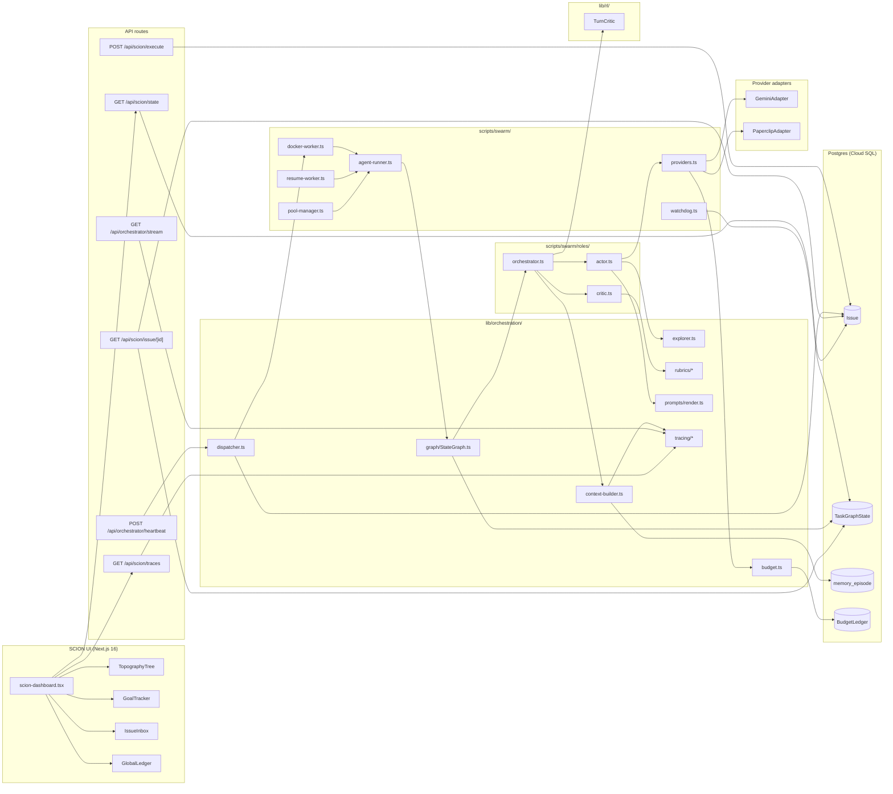

# ARCHITECTURE.md

Single-page architectural reference for `hlbw-ai-hub` as of pass 20 of the Q1 2026 re-arch. For the operator-facing guide, see [CLAUDE.md](CLAUDE.md). For the passes that produced this state, see [docs/re-arch/](docs/re-arch/).

## Overview

`hlbw-ai-hub` is the orchestration control plane for the HLBW ecosystem. It runs a Next.js 16 SCION UI over a Postgres-backed work queue, dispatches graph-orchestrated agent workers into Docker containers, and unifies MCP servers + OTEL tracing across sibling repos. Every unit of work is an `Issue` row; every running agent has a `TaskGraphState` row; every learned fact is a `MemoryEpisode` row (pgvector embeddings). Workers are one-shot: the heartbeat claims ready Issues with `SELECT … FOR UPDATE SKIP LOCKED`, spawns a detached `docker-worker` per claim, and the in-container `agent-runner` drives a StateGraph (`init_mcp → build_context → explore → propose_plan → execute_step ⇄ record_observation ⇄ evaluate_completion → commit_or_loop`) through Actor/Critic/Orchestrator role separation. On kill, watchdog marks the worker paused; resume restarts from the last persisted node. The context window is built dynamically from top-k memory + top-k code symbols + rubric + tool catalogue.

## Component diagram

## Frozen interfaces

| Name | Path | One-line contract |
|------|------|-------------------|
| `StateGraph` | `lib/orchestration/graph/StateGraph.ts` | `start` / `get` / `transition` / `resume` / `interrupt`; each transition is atomic (Prisma `$transaction` + `SELECT … FOR UPDATE`). |
| `Node` | `lib/orchestration/graph/types.ts` | `{ name, run(ctx): Promise<NodeOutcome> }`. |
| `NodeOutcome` | `lib/orchestration/graph/types.ts` | `{ kind: "goto" \| "interrupt" \| "complete" \| "error", next?, contextPatch? }`. |
| `GraphContext` | `lib/orchestration/graph/types.ts` | Typed context bag threaded through nodes; persisted in `TaskGraphState`. |
| `MemoryStore` | `lib/orchestration/memory/MemoryStore.ts` | `write(episode)` / `querySimilar(opts)` / `queryById` / `kind`-scoped reads. |
| `MemoryEpisode` | `lib/orchestration/memory/MemoryStore.ts` | Row model: `kind`, `category`, `taskId?`, `content`, `embedding?`. |
| `CodeIndex` | `lib/orchestration/code-index.ts` | `upsert(symbol)` / `queryBySimilarity(text, k)`. |
| `CodeSymbol` | `lib/orchestration/code-index.ts` | `{ name, kind, path, signature, summary }`. |
| `EmbeddingProvider` | `lib/orchestration/embeddings/EmbeddingProvider.ts` | `embed(text): Promise<number[]>`; 768-dim. |
| `Rubric` | `lib/orchestration/rubrics/types.ts` | `{ name, checks: RubricCheck[], confidenceThreshold }`. |
| `loadRubric` | `lib/orchestration/rubrics/index.ts` | `(category) => Rubric`; dispatches to `1_qa`, `2_source_control`, `3_cloud`, `4_db`, `5_bizops`, `default`. |
| `ActorInput` | `scripts/swarm/roles/actor.ts` | `{ task, contextWindow, previousCritique? }`. |
| `ActorProposal` | `scripts/swarm/roles/actor.ts` | `{ kind: "plan" \| "tool_call", payload, confidence }`. |
| `CriticInput` | `scripts/swarm/roles/critic.ts` | `{ proposal, rubric }`. **Never** contains Actor reasoning. |
| `CriticVerdict` | `scripts/swarm/roles/critic.ts` | `{ verdict: "PASS" \| "REWORK", confidence, findings? }`. |
| `runActorCriticLoop` | `scripts/swarm/roles/orchestrator.ts` | Drives ≤3 cycles; delegates to per-category critic; returns accepted proposal or `needs_human`. |
| `ExplorationContext` | `lib/orchestration/explorer.ts` | Pre-plan exploration state (`budget`, `history`, `notes`). |
| `ExplorationOutcome` | `lib/orchestration/explorer.ts` | `{ continue, summary }`. |
| `filterReadOnlyTools` | `lib/orchestration/explorer.ts` | Predicate to whitelist read-only MCP tools during exploration. |
| `buildDynamicContext` | `lib/orchestration/context-builder.ts` | `(input, deps) => BuildContextOutput`; retrieval-driven window packed by relevance density. |
| `SPAN_ATTR` | `lib/orchestration/tracing/attrs.ts` | Standard OTEL attribute keys (`hlbw.task.id`, `hlbw.role`, `hlbw.graph.node`, …). |
| `fetchRecentTraceSummaries` | `lib/orchestration/tracing/summaries.ts` | `(taskId, opts) => TraceSummary[]`; feeds `BuildContextInput.recentTraceSummaries`. |
| `TurnCritic` | `lib/rl/types.ts` | `recordTurn` / `estimateValue` / `computeAdvantage` / `flush`; default impl is `NoopTurnCritic`. |
| `TurnSnapshot` | `lib/rl/types.ts` | `{ taskId, node, stateHash, action, reward?, metadata }`. |
| `TurnAdvantage` | `lib/rl/types.ts` | `{ taskId, node, advantage, reward, valueEstimate }`. |
| `LLMProviderAdapter` | `scripts/swarm/providers.ts` | `{ name, generate(req), healthcheck() }`; two concrete adapters: `GeminiAdapter`, Paperclip adapter. |
| `dispatchReadyIssues` | `lib/orchestration/dispatcher.ts` | Claims ready Issues (`FOR UPDATE SKIP LOCKED`), spawns detached `docker-worker` per claim. |
| `reclaimStaleWorkers` | `lib/orchestration/dispatcher.ts` | Marks timed-out Issues back to pending per `SWARM_POLICY.workerTimeoutMinutes`. |
| `POST /api/orchestrator/heartbeat` | `app/api/orchestrator/heartbeat/route.ts` | Cron-triggered entry: reclaim stale + dispatch ready. |
| `GET /api/orchestrator/stream` | `app/api/orchestrator/stream/route.ts` | Real SSE off the OTEL span stream, keyed on `taskId`. |
| `POST /api/scion/execute` | `app/api/scion/execute/route.ts` | Creates Thread + graph-rooted Issue; ledger-budget gated. |
| `GET /api/scion/state` | `app/api/scion/state/route.ts` | Aggregated dashboard state (issues + active graphs + ledger). |
| `GET /api/scion/issue/[id]` | `app/api/scion/issue/[id]/route.ts` | Per-issue detail with graph history. |
| `GET /api/scion/traces` | `app/api/scion/traces/route.ts` | Recent OTEL trace summaries for dashboard consumption. |

## Live invariants

- Postgres is the source of truth for `Issue`, `TaskGraphState`, `memory_episode`, and `BudgetLedger`. The `.agents/swarm/state.json` file is a best-effort debug snapshot — never authoritative for Task state.
- `StateGraph.transition` is atomic: Issue update + `TaskGraphState` update + memory writes all commit in one `prisma.$transaction` with `SELECT … FOR UPDATE`.
- Dispatcher claim uses `SELECT … FOR UPDATE SKIP LOCKED`, so N heartbeats across N hosts never double-dispatch an Issue.
- The Critic receives only `CriticInput` (proposal + rubric). It has no access to Actor reasoning. Enforced at the TypeScript type level via `renderCriticPrompt` signature.
- Actor/Critic loop cap: ≤3 rework cycles per node; on exceeded cap the Issue is marked `needs_human`.
- Exploration budget (default 8 tool calls) is read-only: `filterReadOnlyTools` gates the MCP allow-list during exploration.
- `buildDynamicContext` ordering is fixed: rubric → top-k memory → top-k symbols → tool catalogue (compactable) → optional trace summaries → task instruction LAST. Mandatory chunks (rubric, tool catalogue, instruction) survive truncation.
- Embedding provider: `VertexEmbeddingProvider` if `GEMINI_API_KEY` is set, else `StubEmbeddingProvider`. 768-dim vectors. Singleton per process.
- Memory writes: only `PgvectorMemoryStore.write` (via the `shared-memory.ts` adapter). `Neo4jReadAdapter` is read-only and deprecated.
- Code symbols reuse `memory_episode` with `kind: "entity"` — no dedicated schema branch.
- Watchdog interrupts: workers are marked `paused` on kill; `TaskGraphState` persists; `resume-worker.ts` continues from the last node.
- OTEL spans carry only IDs, names, counts, verdicts. No raw prompt text, no PII, no model output in span attributes.
- `lib/` never imports from `scripts/`. Path alias `@/scripts/…` is the only crossing, resolved by Next + jest.
- Raw SQL goes through `Prisma.sql`; no string concatenation.
- Vanilla CSS only in `app/` and `components/`. All styles in `app/globals.css` under semantic class names.

## Known debt

- **14 Tailwind files** (admin/settings/thread/homepage). 181 utility-class occurrences. Tracked in [docs/re-arch/tailwind-migration-queue.md](docs/re-arch/tailwind-migration-queue.md). Render unstyled today since Tailwind is stripped from the CSS pipeline — functional but visually degraded.
- **Symbol seeder** (`scripts/seed-code-symbols.ts`) — not written yet. `PgvectorCodeIndex` starts empty; `queryBySimilarity` returns `[]`; builder tolerates empty.
- **Lint warnings** — 71 at pass 19 baseline (all `_`-prefixed unused-parameter warnings from interface conformance). 0 errors.
- **1 skipped test** — `scripts/swarm/__tests__/state.test.ts` has one skipped case (pre-existing mock gap from pass 2).
- **Cloud Scheduler** — `deploy/scheduler.yaml` is drafted but not wired into `cloudbuild.yaml`. Hooking it in is a pass-20 deploy-time decision per [docs/re-arch/decisions.md](docs/re-arch/decisions.md) D4.

## Further reading

- [docs/re-arch/PLAN.md](docs/re-arch/PLAN.md) — the 20-pass re-arch plan + anti-hallucination protocol.
- [docs/re-arch/checkpoint-05.md](docs/re-arch/checkpoint-05.md) / [checkpoint-10.md](docs/re-arch/checkpoint-10.md) / [checkpoint-15.md](docs/re-arch/checkpoint-15.md) — interface freezes.
- [docs/re-arch/decisions.md](docs/re-arch/decisions.md) — dispatcher defaults for the 5 open plan questions.
- [docs/GEMINI.md](docs/GEMINI.md) — operating manual for AI agents in this hub.
- [docs/GCP-DEPLOYMENT.md](docs/GCP-DEPLOYMENT.md) — Cloud architecture / pipeline.
- [CLAUDE.md](CLAUDE.md) — operator guidance for Claude Code.
