# Agent Directives Graph

This graph visualizes the interconnected web of directives, instructions, and hints extracted from the workspace, mapping them to their originating files and core architectural concepts. It serves as a comprehensive overview for combating context rot and ensuring agent compliance.

```mermaid
graph TD
    subgraph Codebase Files
        F1["/workspace/.agents/skills/directive-enforcer/SKILL.md"]
        F2["/workspace/.agents/workers/directive-enforcer/main.py"]
        F3["/workspace/docs/agent-directive-enforcer.md"]
        F4["/workspace/docs/features/directive-enforcer-sentry.md"]
        F5["/workspace/docs/toolchain-prompt/prompt.md"]
        F6["/workspace/templates/adk-chat-interface/server.js"]
        F7["/workspace/templates/cloud-run/node/index.js"]
        F8["/workspace/templates/docker/node/index.js"]
        F9["/workspace/wrappers/a2a/main.py"]
        F10["/workspace/wrappers/mcp/index.js"]
    end

    subgraph Agent Rules
        subgraph Directives
            D1["Directive Format: MUST/MUST NOT/ALWAYS/NEVER"]
            D2["Security: NEVER commit raw Stripe API keys"]
            D3["Security: OpenTelemetry init MUST NOT be removed"]
            D4["Logic: OpenTelemetry init MUST NOT be removed"]
            D5["Logic: Port MUST always use 'process.env.PORT'"]
            D6["Logic: PORT env var MUST ALWAYS be used for config"]
            D7["Agent Workflow: MUST consult Sentry before writing/committing"]
            D8["Agent Workflow: MCP First"]
            D9["Agent Workflow: Swarm First"]
            D10["Agent Workflow: Control Plane Hygiene"]
        end
        subgraph Instructions
            I1["Instruction Format: Verb-first actionable commands"]
            I2["Bootstrapping Service: Read env, spin up docker, verify health"]
        end
        subgraph Hints
            H1["Hint Format: Brief, objective observation/context"]
            H2["Context: Auth module mocked in local dev"]
            H3["Context: OpenTelemetry init ensures uniformity"]
            H4["Context: Default port for Cloud Run is 8080"]
        end
    end

    subgraph Core Concepts
        C1["Agent Meta-Syntax & Uniformity"]
        C2["Security Best Practices"]
        C3["Observability & Telemetry"]
        C4["Configuration & Environment"]
        C5["Agent Workflow & Coordination"]
        C6["Development Context & Diagnostics"]
        C7["Service Bootstrapping"]
    end

    %% File to Rule links
    F1 -- "contains" --> D1
    F1 -- "contains" --> I1
    F1 -- "contains" --> H1

    F2 -- "contains" --> D1
    F2 -- "contains" --> I1
    F2 -- "contains" --> H1

    F3 -- "contains" --> D2
    F3 -- "contains" --> I2
    F3 -- "contains" --> H2

    F4 -- "contains" --> D7

    F5 -- "contains" --> D8
    F5 -- "contains" --> D9
    F5 -- "contains" --> D10

    F6 -- "contains" --> D3

    F7 -- "contains" --> D4
    F7 -- "contains" --> D5
    F7 -- "contains" --> H3
    F7 -- "contains" --> H4

    F8 -- "contains" --> D4
    F8 -- "contains" --> D6

    F9 -- "contains" --> D3

    F10 -- "contains" --> D4

    %% Rule to Concept links
    D1 --> C1
    D2 --> C2
    D3 --> C3
    D3 --> C2
    D4 --> C3
    D5 --> C4
    D6 --> C4
    D7 --> C5
    D8 --> C5
    D9 --> C5
    D10 --> C5

    I1 --> C1
    I2 --> C7

    H1 --> C1
    H2 --> C6
    H3 --> C3
    H3 --> C1
    H4 --> C4
    H4 --> C6
```

