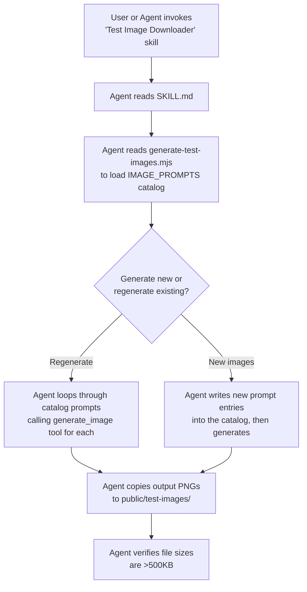

# Test Image Downloader

## Overview
A reusable AI skill that generates high-quality test images of storage containers for AI pipeline testing. Creates both "good" (clear, identifiable) and "bad" (challenging edge case) images designed to be large enough (500–850 KB) to trigger the client-side compression algorithm.

## Tool Location
- **Prompt Catalog:** `.agents/skills/test-image-downloader/scripts/generate-test-images.mjs`
- **Skill:** `.agents/skills/test-image-downloader/SKILL.md`
- **Output:** `public/test-images/`

## Usage
```bash
# View the prompt catalog
node .agents/skills/test-image-downloader/scripts/generate-test-images.mjs
```

To regenerate or add images, invoke the **"Test Image Downloader"** AI skill.

---

## How Future AI Generation Works

The skill uses a **prompt catalog** architecture — not a standalone executable. Here's the workflow:



### Why a prompt catalog and not a script?

The `generate_image` tool is an **AI agent capability** — it can only be called by the agent, not by a Node.js script. So the script serves as:

1. **A prompt database** — stores every prompt with its name, description, and full prompt text
2. **A regeneration guide** — the agent reads the catalog and calls `generate_image` for each prompt
3. **An extension point** — to add new test cases, add a new entry to `IMAGE_PROMPTS.good` or `IMAGE_PROMPTS.bad`

### Prompt Engineering Pattern

Every prompt follows this structure to ensure consistent, high-quality output:

```
Ultra-realistic [angle] photograph of [container type] [location].
Inside: [specific item 1], [item 2], ..., [item N].
[Lighting description], [focus/quality description], [camera style], 4K resolution.
```

Key elements that ensure images are large enough to trigger compression:
- `Ultra-realistic` + `4K resolution` → high detail density
- Specific named items → forces complex texture generation
- Lighting & camera descriptions → realistic optical effects

---

## Good Images (10)

These test the **happy path** — the pipeline should extract items accurately.

| Image | Contents | What It Validates |
|-------|----------|-------------------|
| `good_clear_clothing_box` | Sweater, shoes, book, cable, succulent | Mixed material types (fabric, rubber, paper, metal, organic) |
| `good_organized_tools_bin` | Drill, screwdrivers, tape measure, gloves | Branded items with readable labels |
| `good_kitchen_items_box` | Plates, wine glasses, cutting board, whisk | Fragile items with protective wrapping visible |
| `good_personal_items_box` | Framed photos, vase, DVDs, lamp, fairy lights | Decorative items with irregular shapes |
| `good_kids_toys_container` | Fire truck, LEGO, teddy bear, crayons | Colorful items with distinct shapes and packaging |
| `good_electronics_box` | Laptop, earbuds, hard drive, mouse, cables | Tech items with brand names and small accessories |
| `good_bathroom_supplies_box` | Towels, shampoo, toothpaste, first aid kit | Consumable items with product labels |
| `good_office_supplies_bin` | Stapler, pens, calculator, post-its | Many small distinct items in a clear bin |
| `good_camping_gear_box` | Sleeping bag, stove, headlamp, water bottle | Outdoor gear with mixed textures (nylon, metal) |
| `good_books_media_box` | Novels, vinyl record, headphones, Kindle | Flat/rectangular items with spine text |

---

## Bad Images — Edge Cases (10)

These test the **failure boundaries** — how the pipeline degrades gracefully.

### 1. Motion Blur (`bad_blurry_motion_box`)
- **Challenge:** Camera shake during capture
- **What breaks:** Object detection can't lock onto edges; OCR fails on streaked text
- **Expected pipeline behavior:** Gemini should either return low `confidenceScore` items or reject the image
- **Real-world trigger:** User's hand shakes while photographing a box on the floor

### 2. Near-Total Darkness (`bad_extremely_dark_box`)
- **Challenge:** Extreme underexposure with ISO noise
- **What breaks:** Feature extraction gets mostly noise; colors are unreadable
- **Expected pipeline behavior:** Pipeline should gracefully return few/no items rather than hallucinating
- **Real-world trigger:** User photographs a box in an unlit garage or basement

### 3. Wrapped Items (`bad_wrapped_items_box`)
- **Challenge:** Every item concealed in newspaper and bubble wrap
- **What breaks:** Objects are present but fundamentally unidentifiable — tests whether Gemini honestly reports "wrapped item" vs guessing
- **Expected pipeline behavior:** Should detect "wrapped/packaged items" but not fabricate specific item names
- **Real-world trigger:** Pre-move packing where everything is wrapped for protection

### 4. Extreme Clutter (`bad_overflowing_chaos_box`)
- **Challenge:** Items overflowing, overlapping, spilling out of box
- **What breaks:** Item boundaries overlap; deduplication logic stressed by partial visibility
- **Expected pipeline behavior:** May detect many items but with lower confidence; dedup should handle partial duplicates
- **Real-world trigger:** A hastily packed "junk drawer" box

### 5. Flash Glare (`bad_glare_reflection_box`)
- **Challenge:** Camera flash creates blown-out white hotspot across center
- **What breaks:** Half the image is a white void; reflective items (metal, glass) create secondary flares
- **Expected pipeline behavior:** Should only identify items visible at the edges, not hallucinate items in the glare zone
- **Real-world trigger:** Phone flash bouncing off a plastic bin or shiny items

### 6. Extreme Angle (`bad_extreme_angle_box`)
- **Challenge:** Photo taken from floor level looking up into box
- **What breaks:** Severe perspective distortion; most contents hidden by box walls
- **Expected pipeline behavior:** Should detect very few items with low confidence due to limited visibility
- **Real-world trigger:** Accidental photo angle or photographing a tall box from the side

### 7. Low Contrast / Same Color (`bad_similar_items_box`)
- **Challenge:** All items are the same beige/brown color as the cardboard box
- **What breaks:** Object segmentation can't separate items from container; color-based features useless
- **Expected pipeline behavior:** May struggle to count individual items; should still detect "parcels" or "packages"
- **Real-world trigger:** Box full of brown-paper-wrapped items or unbleached shipping materials

### 8. Partially Closed (`bad_partially_closed_box`)
- **Challenge:** Box flaps cover 90%+ of contents, only a sliver visible
- **What breaks:** Very limited visual information; pipeline must decide if there's enough to identify anything
- **Expected pipeline behavior:** Should either report "box is closed/obstructed" or identify only the tiny visible portion
- **Real-world trigger:** Half-sealed box that user photographs before fully opening

### 9. Scale Mismatch (`bad_tiny_items_huge_box`)
- **Challenge:** Three tiny items (key, battery, paperclip) in a massive wardrobe box
- **What breaks:** Items occupy <1% of image pixels; detection thresholds may miss them entirely
- **Expected pipeline behavior:** Should ideally find the items but may legitimately miss them; tests minimum object size
- **Real-world trigger:** Large box reused for storing a few small items

### 10. Mixed Lighting (`bad_mixed_lighting_box`)
- **Challenge:** Warm tungsten and cool LED lights create split color temperature
- **What breaks:** Same item appears two different colors depending on which light hits it; color-based identification unreliable
- **Expected pipeline behavior:** Should still identify items by shape/form but color attributes may be inaccurate
- **Real-world trigger:** Room with multiple light sources (lamp + overhead) common in garages and basements
