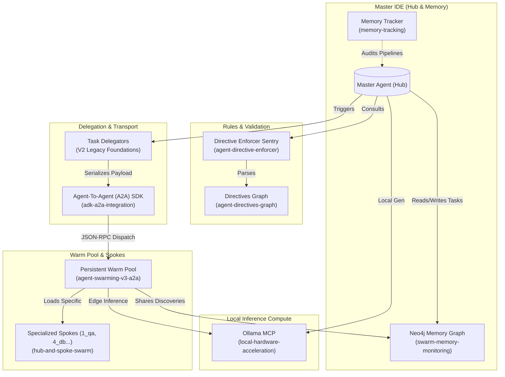

# V3 Swarming Model Architecture (Master Document)

*This is the unified, authoritative architectural specification for the HLBW AI Hub Swarm. It consolidates six legacy technical specifications (Hub-and-Spoke, Swarming V2, ADK A2A Integration, Hardware Acceleration, Memory Monitoring, and Swarming V3 A2A) into a single master reference map to resolve AI context fragmentation.*

---

## System Architecture Map

---

## Part 1: Strategic Guidance & Tool Directory

### Deciding When to Swarm, Spoke, or Accelerate

The AI Orchestrator must use sound technical judgment before spinning up parallel tasks.

**WHEN TO USE THE SWARM (A2A Warm Pools):**

- **Multi-File Refactoring**: When making cross-cutting structural changes, spawn 3-5 workers to handle different functional domains concurrently.
- **E2E Testing / QA**: Push heavy test suites to `1_qa` nodes. This lets the Master Orchestrator keep editing the next file without being blocked by 30-second test runs.
- **Database Migrations / Audits**: Delegate complex database queries to a `4_db` node to sandbox production data access.

**WHEN *NOT* TO USE THE SWARM:**

- **Single-File Bug Fixes**: If changing 3 lines in 1 file, allocating an A2A task adds unnecessary overhead (~2-3 sec dispatch). Just edit it natively in the hub.
- **Direct Chat Investigations**: If the user asks "How does X work?", analyze the code natively instead of delegating to a worker.

**WHEN TO USE LOCAL HARDWARE ACCELERATION (`ollama-mcp`):**

- **Data Formatting / Summarization**: Use the local GPU to parse logs, compress code context, or summarize diffs to save external API costs.
- **Vector Embeddings**: Always run text embedding passes through `nomic-embed-text` locally.

**WHEN *NOT* TO USE LOCAL HARDWARE ACCELERATION:**

- **Complex Code Generation**: Local 7B/8B models (like `qwen2.5-coder:7b`) are not equipped to write robust architectural components.
- **User-Facing Responses**: The orchestrator should rely on its primary Pro model for final output structure.

### Master Taxonomy & Tool Directory

Because IDE contexts limit total active tools (~100), functionality is highly segregated.

#### The Hub (Master Agent)

*Executes at the IDE root `/mcp_config.json`. Focuses strictly on orchestration, file editing, and memory.*

- `ast-analyzer-mcp`: Deep Typescript/Python AST parsing and export analysis.
- `docker-manager-mcp`: Swarm orchestration tool (controls the underlying containers).
- `docker-mcp-gateway`: Master GitHub repository synchronization.
- `memory`: Local Neo4j Knowledge Graph interaction.
- `sequential-thinking`: Reflective logical decomposition.
- `task-delegator-mcp`: Async sub-agent dispatchment.

#### Shared Infrastructure Auto-Booting

The Master Agent's startup sequence natively enforces the lifecycle of infrastructural dependency servers via `toolchain-doctor`. Essential tools (`gcp-trace-mcp`, `memory`) are flagged as mandatory servers, ensuring that the Neo4j graphical database and Jaeger observability dashboards boot implicitly with the IDE before tasks are delegated.

#### The Spokes (Category-Specific Sub-Agents)

*Located in `tools/docker-gemini-cli/configs/`.*

1. **`1_qa`** (Quality Assurance): `ast-analyzer-mcp`, `infrastructure-analyzer-mcp`, `ollama-mcp`
2. **`2_source`** (Source Control): `docker-mcp-gateway`, `ollama-mcp`
3. **`3_cloud`** (GCP Cloud Ops): `cloudrun`, `gcp-logging-mcp`, `gcp-trace-mcp`, `ollama-mcp`
4. **`4_db`** (Database Ops): `dynamic-postgres-mcp`, `ollama-mcp`
5. **`5_bizops`** (Business Metrics): `docker-mcp-gateway`, `ollama-mcp`
6. **`6_project`** (Specialized Tooling): `genkit-mcp-server`, `hlbw-tester`, `ollama-mcp`
7. **`7_automation`** (Smart Home): `home-assistant`

*(Note: `ollama-mcp` is intentionally injected into multiple spokes so offline intelligence is available edge-side).*

---

## Part 2: Hub-and-Spoke Swarm Architecture

**See detailed specification:** [Hub-and-Spoke Swarm Architecture](features/hub-and-spoke-swarm.md)

As Wot-Box grew to integrate dozens of external dependencies, cloud environments, and complex tools via the Model Context Protocol (MCP), it hit a critical architectural barrier: modern IDE extensions (and many LLM contexts) enforce strict limits on the maximum quantity of available functional tools (typically capping at 100).
To solve this and introduce better security domains, the monolithic root agent was split into a **Master Orchestrator (Hub)** and distinct, isolated **Sub-Agents (Spokes)** that each carry a subset of specialized MCP capabilities.

### Spawning Sub-Agents

Agents must *actively* delegate complex or isolated operations to these specific spoke categories by utilizing the Master Orchestrator workflow (`.agents/workflows/master-agent-coordinator.md`).

### Best Practices & Security Boundaries

1. **No Monolithic Leaks:** Never attempt to install heavy, specialized tools (e.g., `postgres-mcp-server`) into the root IDE `mcp_config.json`. Doing so leaks production credentials into the general development context and wastes the 100-tool limit globally.
2. **Context Passing:** Sub-agents only know what they are told in the `<instructions>`. Make sure to provide explicit details (or instruct the sub-agent to retrieve information from Neo4j Shared Memory) before unleashing them.

---

## Part 3: Agent Swarming V3: A2A Warm Pools & Context Isolation

**See detailed specification:** [Agent Swarming V3: A2A Warm Pools](features/agent-swarming-v3-a2a.md)

The Swarming architecture has evolved from a strictly ephemeral, container-per-task model (V2) to a persistent **Warm Pool** model leveraging the Google ADK and Agent-To-Agent (A2A) SDK. This architectural shift eliminates the high latency overhead of aggressive Docker daemon provisioning. By leaving worker containers actively running across `hlbw-network`, the Orchestrator can seamlessly pass jobs to "warm" environments via structured JSON-RPC payloads.

### Persistent Warm Pools

Instead of strictly issuing `docker run` for every individual task, the swarm initializes fixed-capacity sub-agent pools. The Master orchestrator delegates tasks via network requests (HTTP/WS) directly to these running containers.

### Dual Worker Archetypes

1. **Straight Worker** (`hlbw-swarm-worker` / `hlbw-python-worker`): Minimal overhead. Focused on headless scripts and generic logic.
2. **Gemini CLI Worker** (`docker-gemini-cli`): "Fat" container. Runs Google's interactive `@google/gemini-cli` over a headless PTY interface.

### Context Leakage Prevention & Session State

A primary risk of persistent workers is cross-task context leakage. V3 introduces **Session Persistence Policies**:

- **Ephemeral Tasks (Default)**: The standard delegation assigns a unique `task_id`. Once the worker returns a success response, the worker's internal orchestrator actively invokes a `.clear_context()` subroutine (purging memory, clearing working directories).
- **Persistent Sessions (Multi-Turn)**: The Master Agent can transmit an A2A payload with `session_persistence: true`. The worker preserves the context window, file handles, and session ID. All generated `task_id` and `session_id` identifiers **must exclusively utilize alphanumeric UUID formatting** (e.g., UUIDv4) to prevent numerical hallucination or identity overlap within the Swarm AI models.

### Cross-Swarm Resource Mapping

To support massive multi-repository ecosystems, the warm pool employs a "Mount-All" volume strategy. Sibling repositories (e.g., `genkit`, `wot-box`, `hlbw-home-assistant`) are mapped directly to the container's root alongside the primary workspace. This breaks the isolation barrier constructively, permitting sub-agents to traverse interconnected workspaces using standard `../` relative paths, effectively bridging isolated containers with native host-level filesystem parity.

### End-to-End Observability (OTEL & Jaeger)

V3 workers feature granular OpenTelemetry (`@opentelemetry/api`) instrumentation to trace the sub-agent cognitive loop. The execution pipeline binds dynamically to the host's Jaeger instance via the Docker bridge (`host.docker.internal:4318`). This instrumentation transforms tasks into a visual latency waterfall inside Jaeger, segmenting:

- **`sentry-validation-request`**: Time spent waiting on the Hub's centralized rule validation.
- **`llm-generation-turn-[i]`**: Measures pure Gemini API inference delays and latency.
- **`tool-execution-[toolName]`**: Isolates the elapsed duration of filesystem reads, writes, and isolated shell executions.

---

## Part 4: Swarm Concurrency Infrastructure (V2 Legacy Foundations)

While V3 transitions the execution layer to persistent A2A pools, the core state management of the Swarm relies on battle-tested V2 concurrency mechanics:

1. **Git Worktree Isolation (`scripts/swarm/manage-worktree.ts`)**
   Generates physical Git Worktrees for every task with full lifecycle management. Capacity-limited to 15-40 concurrent isolation units depending on policy.
2. **State Management & Backlog (`scripts/swarm/state-manager.ts`)**
   Full backlog API: `addTask`, `listTasks`, `assignTask`, `completeTask`, `updateTaskStatus`. Implements Atomic File Locking (`withStateLock`) to resolve JSON.parse corruption across 24+ asynchronous agents.
3. **Arbiter (`scripts/swarm/arbiter.ts`)**
   Resolves dependency graphs, ensuring blocked tasks wait for prerequisites.
4. **Convenience Delegate API (`scripts/swarm/delegate.ts`)**
   Single-call orchestration: creates task → creates isolation → assigns worker → shares context.
5. **Orphan Cleanup Watchdog (`scripts/swarm/watchdog.ts`)**
   Decoupled from file-locking to prevent starvation. Performs health summaries, stale requeues, and retention cleanup in memory.

---

## Part 5: Local Hardware Acceleration

**See detailed specification:** [Local Hardware Acceleration](features/local-hardware-acceleration.md)

To resolve cloud bottleneck pricing, the environment automatically provisions a local GPU inference engine using `ollama`.
During bootstrapping, it caches:

- **`qwen2.5-coder:7b`**: A fast, local model optimized for coding reasoning.
- **`llava:7b`**: Vision-language model utilized for end-to-end UI testing.
- **`nomic-embed-text`**: Lightweight model for edge vector embedding.

The `ollama-mcp` proxy server acts as a structured API gateway operating over `host.docker.internal:11434`. It exposes `ollama_generate`, `ollama_list_models`, and `ollama_embeddings`. This MCP is systematically injected into the configuration of **multiple sub-agent spokes**, ensuring that every worker node can natively tap into the local GPU swarm.

---

## Part 6: ADK & A2A SDK Integration

**See detailed specification:** [ADK & A2A SDK Integration](features/adk-a2a-integration.md)

The Hub utilizes Google's Agent Development Kit (ADK) and the Agent2Agent (A2A) SDK (`@google/adk`, `@a2a-js/sdk`) for Polyglot cross-platform communication.
These foundational libraries enable the Node.js Master Agent to send structured JSON-RPC workflows securely to the Python Worker containers (and vice/versa) using standard I/O data streams, forming the backbone of V3's fast-response persistence layer.

---

## Part 7: Swarm Memory Real-Time Monitoring

**See detailed specifications:**

- [Swarm Memory Real-Time Monitoring](features/swarm-memory-monitoring.md)
- [Memory Tracking Toolchain](features/memory-tracking.md)

The environment utilizes a Neo4j shared knowledge graph, where entities (Tasks, Workers, Discoveries, Decisions) are mapped dynamically.

### CLI Live Monitor (`scripts/swarm/monitor-memory.mjs`)

A high-signal terminal application that tails the swarm's audit logs (`.agents/swarm/audit.jsonl`).

- `[CREATED]` (Green): New entities added to the graph.
- `[LINKED]` (Blue): Relationships established between entities.
- `[UPDATED]` (Yellow): New observations or facts.
- `[REMOVED]` (Red): Entities deleted.

**Starting the Monitor:**
Run `npm run monitor:memory` in a dedicated terminal to observe memory transitions across parallel sub-agents in real time. For deep-dive structural analysis, the Neo4j Browser can be accessed at `http://localhost:7474`.

---

## Part 8: Agent Directives & Enforcement

**See detailed specifications:**

- [Directive Enforcer Agent Documentation](agent-directive-enforcer.md)
- [Agent Directives Graph](agent-directives-graph.md)

### Sentry Telemetry Routing

To bypass container isolation layers safely, V3 workers forcefully route their Sentry validation payloads out of the container through the Docker bridge interface (`host.docker.internal:8080`). This guarantees the master Hub remains the single, definitive source of truth across all disparate swarms, preventing localized rule drift.
