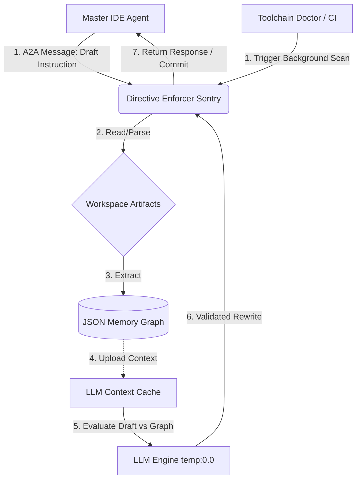

# Directive Enforcer Sentry Replication Blueprint

## Feature Intent

The Directive Enforcer is a Python-based A2A worker agent built into a global toolchain. Its primary role is to enforce unambiguous, strict, Markdown Callout structures (Meta-Syntax) on any agent instructions, hints, or directives embedded across workspace artifacts. The enforcer resolves ambiguity by rejecting loose natural language prompts (e.g., "hello agent, don't forget to"), preventing infinite LLM loops, and consolidating conflicting logic.

## Purpose & Target Outcomes

Maintain a global "memory graph" of all established rules, directives, and hints across a codebase to prevent context rot. Automatically rewrite loose, human-like agent instructions into a strict, machine-enforceable meta-syntax while globally resolving logic conflicts.

## Originating Tech Stack & Context (Reference Only)

- **Language/Compute**: Built initially as a Python script orchestrated as an A2A (Agent-to-Agent) worker within a Next.js/TypeScript monorepo. It relies on standard library Python data structures (`os.walk`, `re`).
- **Data Persistence**: Originally cached the JSON memory graph to standard filesystem `.agents/swarm/directives_graph.json`. Designed to offload this exact structure to an LLM Context Caching layer (like Google Vertex AI Context Cache or OpenAI) for massive repositories.
- **LLM Provider**: Originally built against Google Gemini 1.5 Pro (temperature 0) to exploit 2-million token windows for massive workspace context graphs.

## Integration Points

- **Toolchain Doctor / CI**: Runs periodically (or on push) to scan all `SKILL.md` and repository artifacts.
- **Agent Memory Interceptor**:
> [!IMPORTANT]
> **[Agent Directive: Artifact Validation]**
> Agents MUST ALWAYS consult the Directive Enforcer Sentry via A2A messaging to validate draft instruction changes BEFORE rewriting any `.md` tool rules or skill files or committing any `.md` artifact updates.

## Reference Architecture



The Directive Enforcer acts as a central middleware validation layer. Master Agents or CI routines dispatch draft instructions or trigger scans to the Sentry. The Sentry parses workspace artifacts to maintain a memory graph, which is fed into an LLM engine with massive context capabilities to resolve logical collisions and rewrite instructions into strict Meta-Syntax safely.

## Agent Triggers (Hints, Directives, Instructions)

To ensure orchestrator/master agents use the feature reliably, the following hints/directives must be deployed in your global agent prompt (`GEMINI.md` / `system_instructions.txt`):

> [!TIP]
> **[Agent Hint: Resolving Loops]**
> If you encounter conflicting steps in `task.md` or a skill instruction, ping the Directive Enforcer A2A interface to scan the workspace and advise on which directive holds precedence.

## Capability Contract

> [!NOTE]
> **[Agent Instruction: Capability Contract]**
> 1. Recursively scan the codebase, isolating files with annotation triggers, extracting the exact first 15 lines of context, and raw annotations via regex.
> 2. Offload or inline the JSON graph to an LLM capable of holding massive context windows to evaluate drafts against existing rules.
> 3. Pass a draft instruction to the LLM; the LLM MUST evaluate Global Conflicts, Logical Loops, and Contextual Alignment, returning a safely rewritten instruction.
> 4. Rewrite files safely in CI/CD without mutilating surrounding logic.

---

## Core Logic & Heuristics

> [!IMPORTANT]
> **[Agent Directive: Scanner Logic]**
> The scanner MUST identify files for tracking by detecting specific string triggers and MUST extract annotations using the exact provided regex patterns.

**Detection Triggers**:
- `**[agent `
- `<agent_`
- Legacy triggers: `hey agent`, `agent: remember`, `@agent`, `system prompt directive`

**Extraction Regex (Python standard)**:
- Directives: `r'> \[\!IMPORTANT\].*?\n(?:> .*?\n)+'`
- Instructions: `r'> \[\!NOTE\].*?\n(?:> .*?\n)+'`
- Hints: `r'> \[\!TIP\].*?\n(?:> .*?\n)+'`
- Legacy D/I/H: `r'<agent_directive.*?</agent_directive>'` (with DOTALL)

**Context Windowing**:
> [!IMPORTANT]
> **[Agent Directive: Context Extraction]**
> The parser MUST extract exactly the first 15 lines of every matched file to ensure LLM context.

---

## Data Models

### Annotated File Record Schema
```json
{
  "context_metadata": "<string: first 15 lines of the file>",
  "annotations": {
    "directives": ["<string: matched regex block>", "..."],
    "instructions": ["<string: matched regex block>", "..."],
    "hints": ["<string: matched regex block>", "..."],
    "has_unstructured_legacy": "<boolean>"
  }
}
```

### A2A Protocol Envelope
```json
{
  "sender_id": "<string>",
  "target_id": "directive-enforcer",
  "payload": {
    "action": "get_advice | validate_file | refresh_memory",
    "target_filepath": "<string>",
    "draft_instruction": "<string>",
    "workspace_root": "<string>"
  }
}
```

---

## Tool/API Surface

The Directive Enforcer operates via a single RPC-style HTTP endpoint designed for A2A communication.

- **Endpoint**: `POST /a2a/message`
  - **Payload**: The A2A Protocol Envelope (see Data Models).
  - **Actions**:
    - `get_advice`: Submits a draft instruction for the LLM to rewrite based on the workspace graph. Returns the rewritten instruction.
    - `validate_file`: Forces the LLM to fully rewrite an existing file, stripping old legacy constraints and formatting them into Meta-Syntax.
    - `refresh_memory`: Triggers a manual re-scan of the workspace graph.
- **Port**: Typically bound to `8080` (or `8002` inside Docker depending on orchestration).

## Scheduling/Decision Policies

> [!IMPORTANT]
> **[Agent Directive: Query Policy]**
> Master IDE agents MUST query the Sentry's `get_advice` action BEFORE writing any tool rules or directives.
> [!IMPORTANT]
> **[Agent Directive: Memory Management]**
> The `refresh_memory` action MUST be triggered asynchronously on IDE startup or via periodic CI/CD cron jobs to ensure the Memory Graph does not drift from the active filesystem state.
> [!IMPORTANT]
> **[Agent Directive: Conflict Resolution]**
> If the LLM detects an unresolvable logical loop, the Sentry MUST revert the write and raise a fatal exception outlining the loop to the Master Agent.

---

## System Prompts & LLM Engineering

> [!TIP]
> **[Agent Hint: LLM Engineering]**
> The effectiveness of this feature is entirely dependent on the precise wording of the LLM prompts.

> [!IMPORTANT]
> **[Agent Directive: LLM Configuration]**
> The LLM Engine MUST be configured with a temperature of 0.0.

> [!NOTE]
> **[Agent Instruction: System Prompt Injection]**
> 1. The primary System Instruction MUST be injected verbatim into the LLM Engine's System Prompt.
> 2. The Meta-Syntax Formatting Rules MUST be injected verbatim into the LLM Engine's System Prompt.
> 3. The File Validation Prompt MUST be injected verbatim into the LLM Engine's System Prompt for the `validate_file` action.

```text
You are the Directive Enforcer A2A Agent, the Sentry of the workspace.
Primary Objective: Combat context rot in multi-agent massive context codebases. Context effectiveness must be prioritized!

You will be provided with a cached JSON graph of ALL directives, instructions, and hints across the entire workspace, including their file paths and contextual metadata.

When evaluating a draft instruction or a file modification, you MUST strictly check the following criteria:
1. Global Conflict Check: Does this new/draft directive conflict with ANY other directive in the entire cached workspace graph?
2. Logical Loops & Redundancy: Does this create a loop or redundantly state an existing rule?
3. Contextual Alignment: Given the file's path and metadata in the graph, does this directive belong in THIS file? Or is it misaligned and belongs elsewhere?

CRITICAL RULE FOR MIGRATION/ADVISORY:
If rewriting or migrating an instruction to the new markdown format, you MUST NOT lose any fine-grained detail, specificity, or nuance. Preserve every exact technical constraint and condition.
```

```text
RULE: DIRECTIVE GENERATION
When inserting constraints or absolute rules into an artifact, you MUST use the following syntactic standard to ensure downstream compliance. Never output loose constraints.
Format:
> [!IMPORTANT]
> **[Agent Directive: <Domain>]**
> <A single, concise sentence using MUST, MUST NOT, ALWAYS, or NEVER. No exposition.>

RULE: INSTRUCTION GENERATION
When inserting execution steps or procedural logic into an artifact, you MUST use the following syntactic standard. Avoid paragraph explanations; use strict, enumerated logical steps.
Format:
> [!NOTE]
> **[Agent Instruction: <Action Name>]**
> 1. <Verb-first actionable command>
> 2. <Verb-first actionable command>

RULE: HINT GENERATION
When inserting context, background information, or optimization suggestions into an artifact, you MUST use the following syntactic standard. Clearly label the intent so downstream parsers understand it is non-blocking.
Format:
> [!TIP]
> **[Agent Hint: <Intent>]**
> <Brief observation or context that aids decision-making, written objectively.>
```

```text
EVALUATE AND MIGRATE ENTIRE FILE:
Target File: {filepath}

1. Evaluate all agent rules in this file against the global graph for contextual alignment and conflicts.
2. If conflicts or loops exist, rewrite the rules safely.
3. If legacy tags or ambiguous wording exist, migrate them to the new Markdown Callout standard.
4. CRITICAL: Preserve all original nuance and specific constraints when rewriting.
5. ONLY output the raw file content, preserving all other native code and logic perfectly. Do not wrap in markdown codeblocks.

File Content:
{content}
```

---

## Step-by-Step Implementation Sequence

> [!NOTE]
> **[Agent Instruction: Implementation Sequence]**
> 1. Implement a standalone function to walk directories, ignore artifacts (`node_modules`, `dist`), read target files (`.ts`, `.py`, `.md`), apply string triggers, and run regex extraction logic.
> 2. Ensure the resulting JSON graph is written to disk (e.g., `.agents/swarm/directives_graph.json`) to act as the primary Source of Truth.
> 3. Abstract your LLM API; implement logic to either inline the JSON graph into the prompt (for small codebases) or upload the JSON to an LLM Context Cache (for massive codebases).
> 4. Implement HTTP endpoints (e.g., `POST /a2a/message`) parsing the envelope to route to `get_advice` or `validate_file`.
> 5. Ensure the output stream from the LLM strips backtick fences (```) before writing directly to the disk, preventing file corruption.

---

## Verification Requirements (Definition of Done)

> [!NOTE]
> **[Agent Instruction: Verification Requirements]**
> 1. Create a dummy file with legacy `<agent_directive>` tags and new Markdown Callout tags; assert that the Parser extracts both to the JSON graph.
> 2. Cache a rule "A requires B"; submit draft "B requires A"; assert LLM rejects.
> 3. Submit draft "hey, don't forget to close the server"; assert LLM returns exactly the `> [!NOTE]` meta-syntax structure with numbered steps.
> 4. Submit a 500-line TypeScript file with a single rule; assert the output file contains the exactly translated rule and perfectly preserves the other 495 lines of TypeScript logic.