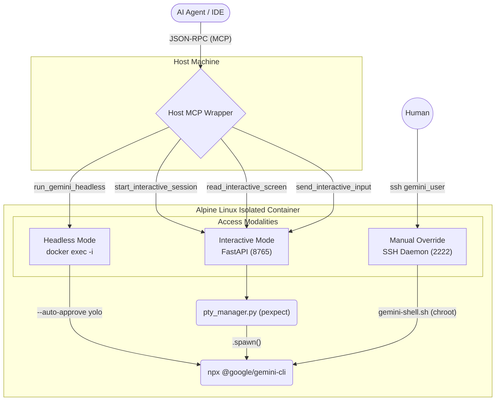

# Containerized Gemini CLI Execution Environment

This toolkit acts as an isolated, robust **Agent-to-Agent (A2A)** sandbox. It spins up a modular, multi-access environment specifically designed to securely parse, interpret, and host headless and interactive sessions for the `@google/gemini-cli` framework.

> [!TIP]
> **Why do we need this?**
> Standard CLI tools are designed for human-in-the-loop workflows. They prompt for confirmations (e.g. `[y/N]`), utilize complex terminal painting (ANSI codes) to render spinners, and assume direct human keyboard input. This environment abstracts all of those complexities away so that **other AI models** can drive truth-seeking and execution flows through the `gemini-cli` autonomously, without ever getting stuck.

---

## 🏗️ System Architecture

The environment relies on a three-tier architecture that isolates execution away from the primary system while exposing seamless hooks back to the orchestrating AI agents (Host MCP Wrapper).



---

## ⚙️ The Three Access Patterns

This environment supports three distinct interaction modalities, tailored strictly for their use-case:

### 1. Host MCP Wrapper (Agentic Orchestration Layer)
The primary interface for tools like Claude Code and the Antigravity IDE. Located in `mcp-wrapper/`, this server passes specific JSON-RPC tool inputs via bridging to the container. The MCP Wrapper has two operating modes:

#### A. Pure Headless Mode (Agentic Default)
The **`run_gemini_headless`** tool executes the `gemini-cli` directly via non-interactive Docker exec processes.
- **Auto-YOLO Enforcement:** The wrapper intercepts all commands and automatically injects `--auto-approve yolo`, removing manual safety blocks safely so tools don't hang.
- **Stdin Payload Streaming:** Agents can pipe enormous context windows directly into the sub-shell natively using local pipes securely.

#### B. Live Interactive PTY Mode (Stateful Tunnels)
When the A2A framework requires answering dynamic, stateful prompts sequentially mapping complex trees, the AI taps into the **PTY WebSocket Driver** using three atomic tools:
1. **`start_interactive_session`**: Spawns a `ws://` WebSocket tunnel locally to the Python daemon inside the container.
2. **`read_interactive_screen`**: Agents continuously call this to poll the screen buffer. It utilizes `strip-ansi` locally in the wrapper to thoroughly scrub terminal painting codes and cursor bytes so the AI only reads clean ASCII text.
3. **`send_interactive_input`**: Pipes keystrokes back up into the PTY.

### 2. FastApi PTY Streams (WebSocket API)
Behind the scenes of the MCP Wrapper, a FastApi `uvicorn` instance runs perpetually inside the Alpine container on port `8765`. It maintains an active bidirectional pipeline to the spawned shell. If preferred, independent clients or web dashboards can tap directly into `ws://localhost:8765/ws`.

### 3. Direct SSH (Interactive Human Layer)
For manual validation or overriding broken states, developers can SSH directly into the network.
```bash
ssh -o StrictHostKeyChecking=no -o UserKnownHostsFile=/dev/null gemini_user@localhost -p 2222
# password is 'password'
```
*Security Note:* This SSH user is constraint-locked to the login shell `/usr/local/bin/gemini-shell`. Attempting to escape the CLI process terminates the SSH connection automatically.

---

## 🚀 Quickstart & Config

### 1. Start the Containerized Suite
```bash
# To run basic without any staged MCP profiles
cd tools/docker-gemini-cli
docker compose up -d --build
```

### 2. Dynamic MCP Staging (Zero Config)
The `build.sh` script automatically structures nested Model Context Protocol payloads dynamically.
Capabilities are defined inside `mcps/<topic>/`. By executing the script, configurations are mapped onto the `gemini_user` volume during initialization.

```bash
# To stage the environment with github modules
./build.sh github
docker compose up -d
```

### 3. Environment Context
By relying on `docker-compose`, the application uses a **Zero-Configuration Passthrough**. It automatically reads from the host workspace `../../.env` file. Thus, the orchestration guarantees that sensitive identifiers like `GEMINI_API_KEY` are mounted as environment variables during bootstrap flawlessly.
