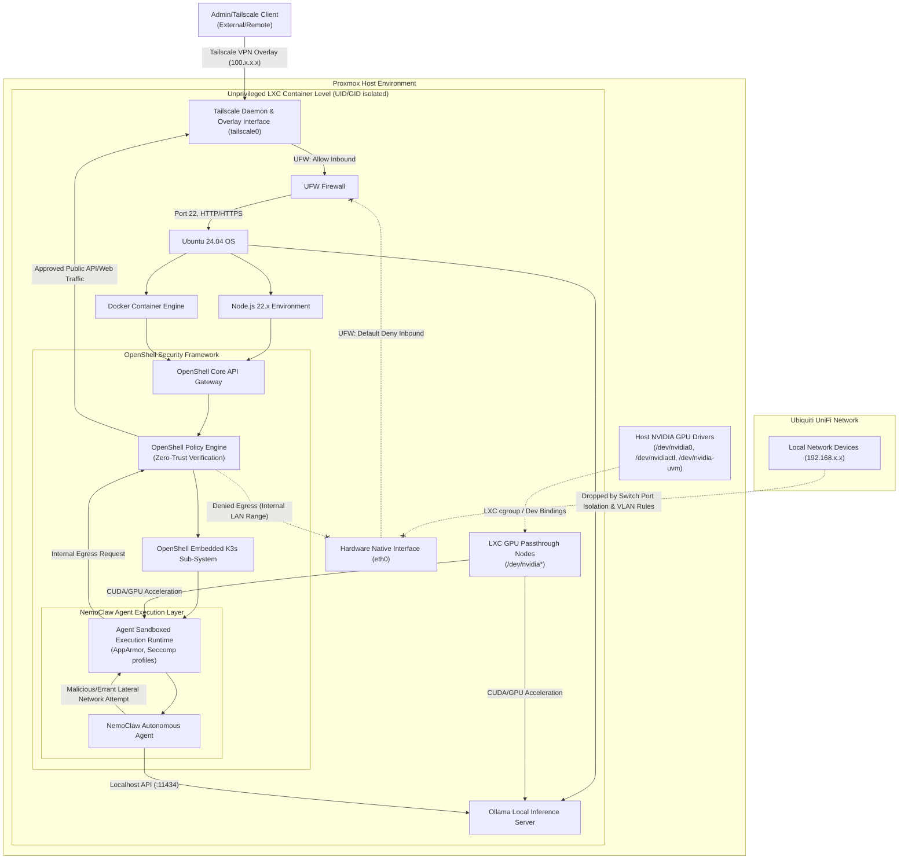

# NVIDIA NemoClaw LXC Build Pipeline for Proxmox

This repository provides a deployment pipeline for installing [NVIDIA NemoClaw](https://github.com/NVIDIA/NemoClaw) inside a secure, zero-trust Proxmox LXC container. It isolates NemoClaw from your primary network and ensures ingress access is limited entirely to Tailscale connections securely.

## System Architecture

The architecture relies on defense-in-depth principles. At every layer, we restrict what the agent environment can touch, while enforcing safe remote management. 



## Security Posture: Inherent Controls vs Active Hardening

Running AI agents autonomously brings inherent risks of unwanted network hopping, unauthorized data access, or resource abuse. This environment combines structural components brought natively by NVIDIA's tools with crucial manual networking mitigations that you must configure.

### Inherent Controls (NemoClaw & OpenShell)

These protections are baked directly into the NVIDIA OpenShell runtime that NemoClaw leverages. Because the agent processes are executed completely within OpenShell's localized K3s pods, the LXC container inherits an initial safety foundation from the installation scripts:

1. **Egress Network Filtering**: OpenShell runs all sandboxes with a strict **"Deny by Default"** firewall mechanism inside its runtime proxy array. If an agent tries to `curl` a resource without an explicit OpenShell YAML policy allowing that host and path, it is denied by the internal L7 layer proxy.
2. **Filesystem Confinement**: OpenShell uses Linux `Landlock` to prevent the agent from writing to, or reading from, unauthorized local filesystem structures.
3. **Application Syscalls**: Seccomp profiles and the stripping of `root` Linux capabilities prevent the active NemoClaw instances from creating dangerous hooks or escaping their K3s sub-sandbox.
4. **Credential Obfuscation**: The agent container never contains direct runtime credentials on the disk. They are selectively bound as environment variables by the Gateway, abstracting sensitive keys away from the LLM code memory.

### Local AI Inference (Ollama Integration)

The script automatically provisions **Ollama** natively within the LXC. 
- **GPU Association**: It scans for and attaches itself directly to the `/dev/nvidia*` instances physically mapped via Proxmox `cgroups`.
- **API Sandbox**: It dynamically spins up an OpenAI-compatible API endpoint exclusively on `http://localhost:11434/v1`. 
- **Agent Connectivity**: Because the LXC is fiercely locked down by UFW and Unifi VLAN rules, NemoClaw securely accesses Ollama purely via the local loopback interface, pulling and executing models without risking private data exfiltration to external internet services.

### Required Manual Configurations (Least-Privilege Setup)

Even with powerful internal sandboxing, operating an LXC inside your homelab necessitates outer physical boundaries that you must actively configure. **This build logic requires action on your end to seal the host networking layer:**

> [!CAUTION]
> **Why do we need this if OpenShell is safe?**
> A sophisticated attack or an open proxy exploit on the parent LXC could bypass the internal OpenShell layers. We mitigate this by completely isolating the LXC node from the wider homelab mesh. 

| Layer | Configuration Needed | Purpose for Least Privilege |
|---|---|---|
| **UniFi Network (VLAN)** | Configure an isolated Network/VLAN (e.g., VLAN `50`). Enable absolute **Device Isolation**. Setup specific firewall rules blocking traffic from VLAN `50` to any `RFC1918` local private subnets (e.g. `192.168.1.0/24`). | Ensures that even if the LXC is compromised entirely, the network switch drops any TCP/UDP sweeps directed into your private smart home topology. |
| **LXC Mode (Proxmox)** | Maintain `unprivileged: 1` on the LXC configuration whenever possible. | Runs the container under high-ID user namespaces to ensure root processes inside the LXC translate to unprivileged entities on the host node. |
| **UFW Rules (LXC Script)** | Enforced automatically by `nemoclaw-install.sh`. Drops all inbound connections on the `eth0` pipeline. Allows `tailscale0`. | Ensures internal LXC daemons (like SSH or K3S API bounds) do not inadvertently broadcast locally. |
| **Tailscale ACLs** | Validate Tailscale configuration panels to guarantee standard nodes cannot interface with this LXC unless tagged explicitly as administrators. | Allows remote management interfaces to securely bridge through, reducing lateral exploitation. |

## Pre-Requisites

1. Put the three `.sh` scripts (`proxmox-gpu-installer.sh`, `nemoclaw.sh`, and `nemoclaw-install.sh`) onto your bare-metal Proxmox host (for example into a folder like `/root/nemoclaw`).
2. Make them all fully executable. You can do this with a single command:
   ```bash
   chmod +x *.sh
   ```
3. Optional: Obtain a [Tailscale Pre-Auth Key](https://login.tailscale.com/admin/settings/keys) for headless VPN onboarding.

### Step 0: Host NVIDIA Driver Installation (If Needed)
If you have not already successfully installed the proprietary NVIDIA drivers directly on your bare-metal Proxmox host, you must do so before attempting to deploy the LXC container. **Do not install drivers inside the LXC.** 

We have provided an automated wrapper that safely unlocks the Debian `non-free-firmware` repository, handles the complex Proxmox kernel header mappings, blocks the crashing open-source `nouveau` drivers, and installs `nvidia-driver` via APT.

```bash
./proxmox-gpu-installer.sh
```

> [!NOTE]
> **Will standard OS updates wipe out the driver?**
> No! Because this script natively installs the driver via the package manager and sets up the strict Proxmox headers, it rigorously triggers **DKMS** (Dynamic Kernel Module Support). When you run standard `apt upgrade` commands and Proxmox sequentially pulls down a newer kernel patch, DKMS automatically detects the update and seamlessly recompiles your NVIDIA drivers in the background to match it perfectly. 
> *(If you ever actively want to wipe it out, simply run `apt purge "^nvidia.*"`)*

*Note: You must reboot your Proxmox server after running this script for the kernel modules to fully swap before manually running `nvidia-smi` to test.*

## Step 1: Network Isolation (VLAN or Proxmox Firewall)

To prevent the autonomous agent from performing lateral movement across your local network if it goes rogue, you must isolate its outbound traffic. You can choose **one** of the two following methods:

### Option A: Physical UniFi VLAN (Recommended if you have managed switches)
1. Open the Ubiquiti **UniFi Network Application**.
2. Go to **Settings > Networks > Create New Network**.
3. Create a network (e.g., VLAN ID `50`, Network Name: `AI-Isolation`).
4. Set **Advanced Configuration** to Manual, and under **Isolation**, turn on **Device Isolation** to prevent clients from talking to each other.
5. In your UniFi Firewall rules, block traffic from VLAN `50` to your primary `RFC1918` (Internal) subnets to avoid lateral infiltration. 
6. In **Proxmox Virtual Environment**, ensure that your node's bridge (usually `vmbr0`) is checked as **VLAN aware**. (You will pass the VLAN ID in Step 3).

### Option B: Proxmox Native Firewall (Recommended if you don't use VLANs)
If you don't have a Unifi system or managed switches, you can achieve the exact same zero-trust isolation natively built right into the Proxmox hypervisor **fully automatically**.

When you run the `./nemoclaw.sh` deployment script in Step 3, it will explicitly ask you:
`Enable Native Proxmox Firewall Isolation? (y/N):`

If you answer `y`, the script automatically provisions the container interface with the firewall flag enabled and injects the proper internal 3-rule routing logic (`ACCEPT` Gateway -> `DROP` Subnet -> `ACCEPT` Internet) so you don't have to configure anything manually in the Proxmox UI. You simply need to provide it your router's IP and your local subnet range when prompted.

## Step 2: Preparing the Scripts

1. Retrieve (`git clone` or copy) the scripts into a directory on your Proxmox Host natively (e.g., `/root/nemoclaw`).
   ```bash
   mkdir -p /root/nemoclaw
   cd /root/nemoclaw
   ```
2. Place both `nemoclaw.sh` and `nemoclaw-install.sh` in this folder.
3. Make them executable:
   ```bash
   chmod +x nemoclaw.sh
   ```

*Optional but Recommended:* Generate a one-time [Tailscale Pre-Auth Key](https://login.tailscale.com/admin/settings/keys) to fully automate the internal build routine.

## Step 3: Running the Container Builder

1. Execute the wrapper script:
   ```bash
   ./nemoclaw.sh
   ```
2. Follow the CLI Prompts:
   - **Container ID**: Supply the VM ID or press Enter to pick the next sequential one automatically.
   - **Storage Pool**: Define the Proxmox drive pool (default `local-lvm`).
   - **VLAN ID**: Enter the VLAN ID you created above (e.g. `50`).
   - **GPU Passthrough**: Type `y` if you plan to share the host's NVIDIA GPU with the container. This will append the necessary generic `cgroup` logic to map `/dev/nvidia*`. 
   
   > [!WARNING]
   > Make sure Proxmox has NVIDIA drivers loaded. Unprivileged LXC mappings can be complex—if you encounter GPU mapping errors later, you will need to map host UIDs directly via `/etc/pve/lxc/<id>.conf` or change to `unprivileged: 0` (Privileged execution reduces security posture). 

## Step 4: Run the NemoClaw Inside the Container

1. Wait for the new LXC to fully start up and grab its IP lease.
2. Enter the LXC shell using the provided Virtual Machine ID:
   ```bash
   pct enter <container_id>
   ```
3. Run the automatic internal setup script that was safely pushed inside the container during Step 3:
   ```bash
   /root/nemoclaw-install.sh
   ```
4. If prompted, paste in your Tailscale Pre-Auth Key. Alternatively, leave it blank, and the installer will leave the Tailscale `node` in manual mode (prompting you to run `tailscale up --ssh` manually later to click the authentication link).

## Next Steps

Once the installation finishes, you will be successfully connected via zero-trust to an isolated agent layer:
- Type `exit` to leave the `pct enter` prompt on the host machine.
- Start an SSH session targeted strictly towards your container's **Tailscale IP**.
- The `nemoclaw` and `openshell` CLIs will be fully available in that session. 
- You can now safely onboard `OpenClaw` instances safely utilizing official documentation.
